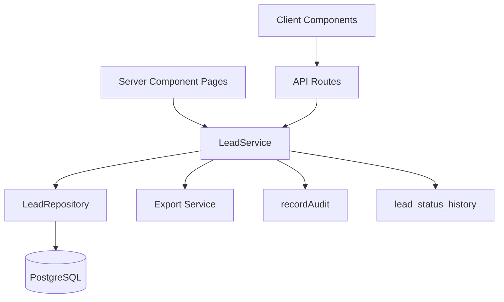

# Phase 7 — Complete Lead Management Core

## Objective

Deliver a production-ready Lead Management module on top of the Phase 3 `leads` table and Phase 6 API foundation, with **no rework** and **no fake business data / AI scores**.

Scope:

- Create / view / edit / archive (soft-delete) leads.
- Lead list with combinable filters, search, sort, pagination, and summary KPI cards.
- Lead detail page with status history timeline and owner/source/status management.
- Export to CSV, XLSX, and PDF (server-side file generation).
- RBAC enforcement (`leads.view/create/edit/delete/export/assign`).
- Full tenant isolation (`organization_id` from session, never from the client).
- Audit integration and a status-history foundation for Phase 8+.
- AI-ready fields remain present but always render "Not scored yet" (no fake scores).
- Clean extension points: qualification (Phase 8), AI scoring (Phase 9), assignment/dedup (Phase 10).

## Approved Decisions

1. **Export**: add `exceljs` + `pdfkit` (server-only) for real XLSX/PDF, plus native CSV. `exceljs` also provides a reliable CSV writer; a small native CSV helper is used for the CSV path.
2. **Schema reconciliation** (minimal migration, matches spec exactly):
   - Add nullable `first_name` / `last_name` to [`leads`](db/schema/sales.ts:31), kept in sync with the canonical `full_name`.
   - Add missing `lead_source` enum values: `google_search`, `partner_referral`, `paid_advertisements`, `cold_calls`, `direct_email`, `tradeshows_events`, `existing_customers`, `others`.
   - Add a `lead_status_history` table as the status-history foundation.

## Architecture Overview



Layering stays consistent with the existing codebase: **routes → service → repository → db**. UI hiding via [`Can`](components/auth/can.tsx:34) is convenience only; every server action and route enforces its own permission.

## Schema Changes

### [`db/schema/enums.ts`](db/schema/enums.ts:23)

Append to `leadSourceEnum`:

```
google_search, partner_referral, paid_advertisements,
cold_calls, direct_email, tradeshows_events, existing_customers, others
```

Keep the existing 8 values (no removal — removal risks rework/data loss). UI presents the canonical Track A list first, legacy values last.

### [`db/schema/sales.ts`](db/schema/sales.ts:31)

- Add `firstName` (`varchar 128`, nullable) and `lastName` (`varchar 128`, nullable) to `leads`.
- Add `leadStatusHistory` table:

| Column | Type | Notes |
| --- | --- | --- |
| id | uuid PK defaultRandom | |
| organizationId | uuid notNull FK | tenant scope |
| leadId | uuid notNull FK cascade | |
| fromStatus | leadStatusEnum nullable | null on first transition |
| toStatus | leadStatusEnum notNull | |
| changedBy | uuid FK users set null | |
| changedAt | timestamptz defaultNow notNull | |
| notes | text nullable | |

Indexes: `(organizationId, leadId)`, `(organizationId, changedAt)`.

`firstName` + `lastName` are the **canonical structured identity** for Phase 7 and future phases. `fullName` is kept only for backward compatibility and is always synchronized (derived) by the service on create/update — there is a single source of truth (the service), never duplicate business logic maintaining both representations. A safe data backfill sets `firstName`/`lastName` from the existing `fullName` where both new columns are null and `fullName` is non-empty.

## New Files

### Server layer

- [`server/repositories/leads.ts`](server/repositories/leads.ts) — `LeadRepository extends TenantRepository`. Scoped CRUD + list query (joins owner + status history counts) + summary aggregates + export row fetch.
- [`server/services/leads.ts`](server/services/leads.ts) — `LeadService`. Business rules: name sync, lead-number generation, status transitions (writes history + audit), owner assignment (writes `lead_assignments` + audit), soft-delete, list orchestration, summary.
- [`server/services/lead-export.ts`](server/services/lead-export.ts) — server-only CSV/XLSX/PDF generation (dynamic import of `exceljs`/`pdfkit`).

### Validation + presentation

- [`lib/leads/schemas.ts`](lib/leads/schemas.ts) — Zod schemas: create, update, status, assign, filter.
- [`lib/leads/presentation.ts`](lib/leads/presentation.ts) — enum → human label + Badge variant maps for source/status/qualification. Single source of UI text.

### API routes

- [`app/api/leads/route.ts`](app/api/leads/route.ts) — `GET` list (requires `leads.view`), `POST` create (requires `leads.create`).
- [`app/api/leads/[id]/route.ts`](app/api/leads/[id]/route.ts) — `GET` detail (`leads.view`), `PATCH` update (`leads.edit`), `DELETE` archive (`leads.delete`).
- [`app/api/leads/[id]/status/route.ts`](app/api/leads/[id]/status/route.ts) — `PATCH` status change (`leads.edit`).
- [`app/api/leads/[id]/assign/route.ts`](app/api/leads/[id]/assign/route.ts) — `PATCH` owner assignment (`leads.assign`).
- [`app/api/leads/export/route.ts`](app/api/leads/export/route.ts) — `GET ?format=csv|xlsx|pdf` (`leads.export`), rate-limited.

All routes use [`requireApiContext`](lib/api/context.ts:14) for session + permission + tenant, [`parsePagination`](lib/api/query.ts:25) / [`parseSort`](lib/api/query.ts:54) / [`parseFilters`](lib/api/query.ts:81), and the standard [`success`](lib/api/response.ts:23) / [`failure`](lib/api/response.ts:38) envelope.

### Components (client leaves)

- [`components/leads/lead-table.tsx`](components/leads/lead-table.tsx) — interactive table: search, filters, sortable columns, pagination, export menu.
- [`components/leads/lead-form.tsx`](components/leads/lead-form.tsx) — shared create/edit form.
- [`components/leads/lead-actions.tsx`](components/leads/lead-actions.tsx) — detail page actions (edit, status change, assign, archive) gated by [`Can`](components/auth/can.tsx:34).
- [`components/leads/lead-status-history.tsx`](components/leads/lead-status-history.tsx) — status timeline.
- [`components/leads/index.ts`](components/leads/index.ts) — barrel.

### Pages (rewrite existing placeholders)

- [`app/(app)/leads/page.tsx`](app/(app)/leads/page.tsx) — server component: KPI summary + hydrated [`lead-table`](components/leads/lead-table.tsx).
- [`app/(app)/leads/new/page.tsx`](app/(app)/leads/new/page.tsx) — create page using [`lead-form`](components/leads/lead-form.tsx).
- [`app/(app)/leads/[id]/page.tsx`](app/(app)/leads/[id]/page.tsx) — detail page: fields, status history, actions.

### Tests + docs

- [`db/leads-smoke.ts`](db/leads-smoke.ts) — end-to-end smoke test (create → list → filter → status → assign → export → archive → verify history/audit/isolation).
- [`docs/LEADS.md`](docs/LEADS.md) — API contract, filters, export, permission matrix.

### Dependencies

- Add `exceljs` and `pdfkit` (+ `@types/pdfkit` dev) to [`package.json`](package.json:21).

## Modified Files

- [`db/schema/enums.ts`](db/schema/enums.ts:23) — add source values.
- [`db/schema/sales.ts`](db/schema/sales.ts:31) — add name columns + `leadStatusHistory`.
- [`db/seed/index.ts`](db/seed/index.ts:62) — seed realistic fictional leads (with owners + statuses, AI fields left `null`).
- [`package.json`](package.json:21) — export deps.
- New migration via `npm run db:generate` + `npm run db:migrate`.

## Status History Foundation

Every status change (including initial creation as `new`) inserts a `lead_status_history` row and a `status_change` [`recordAudit`](lib/api/audit.ts:20) entry. Owner changes insert `lead_assignments` + `assign` audit. This is the Phase 8/10 extension point.

## AI State

`aiScore`, `aiScoreCategory`, `aiScoreConfidence`, `qualificationStatus` are **never fabricated**. The UI renders a neutral "Not scored yet" state when `aiScore` is null and "Qualification pending" when `qualificationStatus === "pending"`.

## Permissions

| Action | Permission | Roles |
| --- | --- | --- |
| List / detail | `leads.view` | all 4 |
| Create | `leads.create` | all 4 |
| Edit / status | `leads.edit` | all 4 |
| Archive | `leads.delete` | Super Admin, Admin |
| Export | `leads.export` | Super Admin, Admin, Sales Manager |
| Assign | `leads.assign` | Super Admin, Admin, Sales Manager |

Matrix already present in [`lib/permissions/index.ts`](lib/permissions/index.ts:73); no RBAC changes needed.

## Validation

- `npm run typecheck`, `npm run lint`, `npm run build`.
- `npm run db:generate` + `npm run db:migrate`.
- `npm run db:seed`.
- `tsx db/leads-smoke.ts`.
