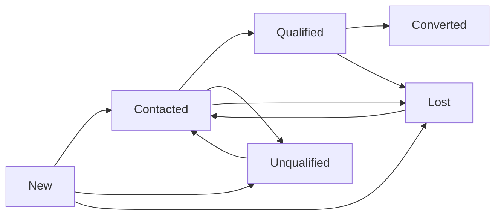

# Phase 8 — Lead Lifecycle & Qualification Engine

## Objective

Add a complete, structured, auditable **Lead Lifecycle** and **Qualification
Engine** on top of Phases 1–7, with **no rework** and **no AI**. This becomes the
permanent foundation for Phase 9 AI scoring, Phase 10 assignment/dedup, and
Phase 11 client conversion.

## Existing assets reused (no duplicates)

- [`leads`](db/schema/sales.ts:31) and its `qualificationStatus` /
  `aiScore` / `qualificationMetadata` columns.
- [`leadStatusHistory`](db/schema/sales.ts:86) — lifecycle history (extended,
  not replaced).
- [`leadQualifications`](db/schema/sales.ts:118) — the qualification assessment
  model (restructured, not replaced).
- [`LeadService.changeStatus`](server/services/leads.ts:231) — transition logic
  (hardened with lifecycle rules).
- [`LeadActions`](components/leads/lead-actions.tsx:18) and
  [`LeadStatusHistory`](components/leads/lead-status-history.tsx:11) — UI.
- Phase 5 RBAC (`leads.*`), Phase 6 API envelope/validation/audit, Phase 2 UI.

## Key distinction (maintained throughout)

- **Lifecycle status** (`leads.status`): `new / contacted / qualified /
  unqualified / converted / lost`.
- **Qualification outcome** (`leadQualifications.result`): `pending /
  qualified / partially_qualified / unqualified`.

A lead can be `contacted` + `partially_qualified` without its lifecycle status
changing incorrectly.

## Lifecycle rules (centralized)

- Terminal states: `converted`, `lost` (reopening `lost → contacted` allowed).
- Invalid transitions rejected server-side (e.g. `converted → new`).
- `contacted → qualified` requires a completed assessment with outcome
  `qualified`.

Centralized in a single module; never scattered across pages/routes/queries.

## Qualification framework (7 criteria)

Structured enum values (lower_snake_case storage) with per-criterion labels and
explanations:

| Criterion | Controlled values |
| --- | --- |
| Requirement clarity | clear, partially_clear, unclear, unknown |
| Budget availability | confirmed, estimated, not_confirmed, unknown |
| Purchase timeline | immediate, 0_30_days, 31_90_days, 3_6_months, 6_plus_months, unknown |
| Decision maker | identified, partially_identified, not_identified, unknown |
| Company scale | strong_fit, moderate_fit, weak_fit, unknown |
| Product/service fit | strong_fit, partial_fit, weak_fit, unknown |
| Conversion probability (manual) | high, medium, low, unknown |

Commercial context (budget amount, expected close date, company size,
interested product) is shown from the existing lead fields — not duplicated.

## Outcomes

`pending` (not assessed), `qualified`, `partially_qualified`, `unqualified`.
Legacy enum values `needs_nurture` and `disqualified` remain for
backward-compat but are aliased in presentation to `partially_qualified` and
`unqualified`.

## Database changes (minimal migration)

- Add enum types for the 7 criteria + outcome values + disqualification reason.
- Restructure `leadQualifications`: replace 6 integer columns with 7 structured
  enum columns, add `decisionMakerName` / `decisionMakerDesignation`.
- Add `reason` (controlled string) to `leadStatusHistory`.

Existing `leads` rows are preserved (migration only adds enum values and alters
`leadQualifications` / `leadStatusHistory`).

## Permissions (reuse Phase 5, no matrix change)

- View qualification/history → `leads.view`.
- Create assessment / lifecycle transition → `leads.edit`.
- `leads.approve` is reserved for Phase 11 conversion approval (documented).

Server enforces; UI hiding via `Can` is convenience only.

## Transaction safety

Creating an assessment that also applies a transition (e.g. outcome `qualified`
→ lifecycle `qualified`) runs in a single DB transaction. Failure rolls back
both.

## New files

- [`lib/leads/lifecycle.ts`](lib/leads/lifecycle.ts) — centralized lifecycle
  states, transitions, terminal flags, descriptions, permissions.
- [`lib/leads/qualification.ts`](lib/leads/qualification.ts) — 7 criteria +
  outcome definitions, labels, explanations.
- [`server/repositories/qualification.ts`](server/repositories/qualification.ts) — tenant-scoped
  qualification data access.
- [`server/services/qualification.ts`](server/services/qualification.ts) — qualification business
  logic + transactional outcome→transition.
- [`app/api/leads/[id]/qualification/route.ts`](app/api/leads/[id]/qualification/route.ts) — GET
  history + POST create.
- [`components/leads/lifecycle-stepper.tsx`](components/leads/lifecycle-stepper.tsx) — lifecycle
  visualization.
- [`components/leads/qualification-form.tsx`](components/leads/qualification-form.tsx) — reusable
  assessment form.
- [`components/leads/lead-qualification.tsx`](components/leads/lead-qualification.tsx) — display
  card + history.
- [`db/qualification-smoke.ts`](db/qualification-smoke.ts) — tests.

## Modified files

- [`db/schema/enums.ts`](db/schema/enums.ts) — new enums.
- [`db/schema/sales.ts`](db/schema/sales.ts) — restructure `leadQualifications`,
  extend `leadStatusHistory`.
- [`lib/leads/schemas.ts`](lib/leads/schemas.ts) — qualification + transition Zod
  schemas.
- [`lib/leads/presentation.ts`](lib/leads/presentation.ts) — labels/variants.
- [`server/services/leads.ts`](server/services/leads.ts) — enforce lifecycle
  rules in `changeStatus`.
- [`app/api/leads/[id]/status/route.ts`](app/api/leads/[id]/status/route.ts) — accept
  reason, delegate to hardened service.
- [`components/leads/lead-actions.tsx`](components/leads/lead-actions.tsx) — controlled
  Change Status flow.
- [`app/(app)/leads/[id]/page.tsx`](app/(app)/leads/[id]/page.tsx) — add lifecycle
  stepper + qualification section.
- [`db/seed/index.ts`](db/seed/index.ts) — structured qualification seed.
- [`docs/LEADS.md`](docs/LEADS.md) — document lifecycle/qualification.

## Validation

Typecheck, lint, production build, migration + seed, and
`db/qualification-smoke.ts` (lifecycle, qualification, RBAC, tenant isolation,
regression).
